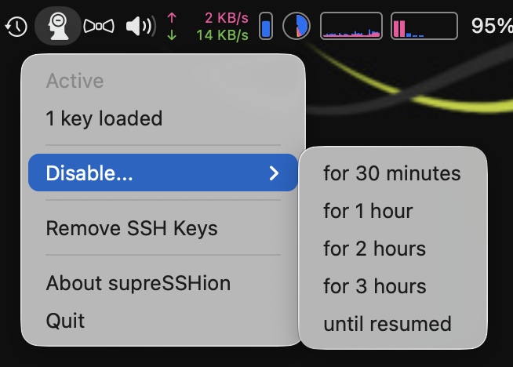

# supreSSHion

A macOS menu bar agent that listens for screen lock and sleep events and then communicates with ssh-agent to unload keys
from memory. It can also temporarily disable this functionality as requested by the user.

Minimum version of macOS is macOS 15.x/Sequoia.

## How it works

When launched, supreSSHion registers itself as a listener for "screen is locked" and "workplace will sleep" events.

When it receives a lock event, it communicates with ssh-agent over its unix socket asking ssh-agent to unload all known
keys. It locates the unix socket by the SSH_AUTH_SOCK environment variable. macOS automatically creates that environment
variable when you log in.

If the key removal functionality is disabled, lock events will not trigger key removal. When the screen is locked and
the expiration time of the disable has been reached, the keys will be removed.

When a sleep event is received, it will reactivate the key removal if the user had disabled the key unloading
functionality.

### Additional Functionality

* New in version 2.0, you can see which keys are loaded by selecting the "keys loaded" menu entry when there are keys
  loaded into memory.

### What about loading my SSH key?

You can add `AddKeysToAgent yes` to your ssh config. If your key isn't loaded when ssh is invoked, ssh will prompt you
for your key. (You may also want to specify your key using `IdentityFile /path/to/id`.)

This doesn't work in all cases where you might use ssh, but 99.99% of the time I'm invoking ssh from a terminal and it
works very well for me.

## License

supreSSHion is distributed under the MIT free software license, and freely available for inclusion in other projects.

## Credits

App icon is [Forget by Gregor Cresnar from the Noun Project](https://thenounproject.com/term/forget/539392/). It is
licensed under [Creative Commons CCBY](https://creativecommons.org/licenses/by/3.0/us/).
