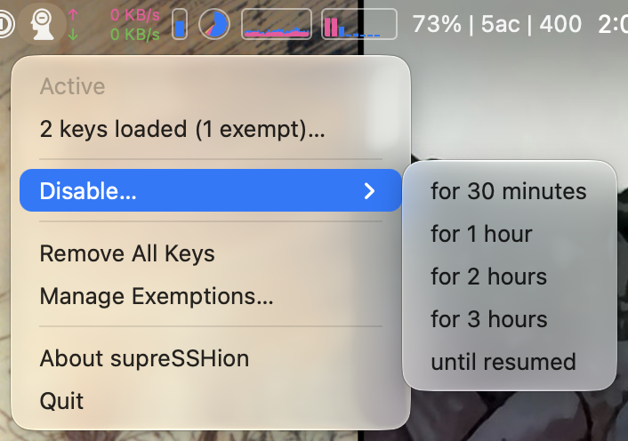
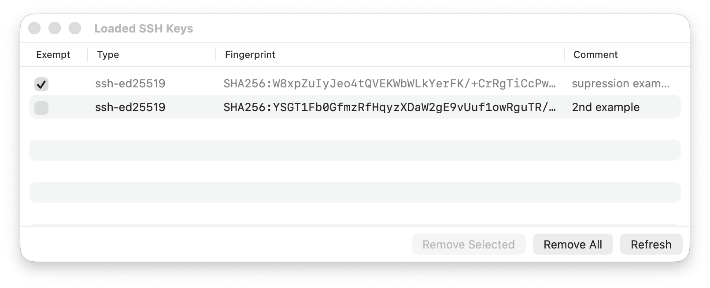

# supreSSHion

A macOS menu bar agent that listens for screen lock and sleep events and then communicates with ssh-agent to unload keys
from memory. It can also temporarily disable this functionality as requested by the user. You can also view loaded keys
and unload all or selected keys via a dialog.

Requires macOS 15 Sequoia or later.

## How it works

When launched, supreSSHion registers itself as a listener for "screen is locked" and "workspace will sleep" events.

When it receives a lock event, it communicates with ssh-agent over its unix socket asking ssh-agent to unload all known
keys. It locates the unix socket via the `SSH_AUTH_SOCK` environment variable, which macOS sets automatically at login.

If the key removal functionality is disabled, lock events will not trigger key removal. When the screen is locked and
the expiration time of the disable has been reached, the keys will be removed.

When a sleep event is received, it will reactivate the key removal if the user had disabled the key unloading
functionality.

### Exempting a key from removal

Sometimes you want one key to stay loaded across a lock — a long-running session to a low-risk host, say — while
everything else still gets flushed. Open the keys dialog and check **Exempt** next to that key; it will be skipped the
next time the screen locks or the disable timer expires. Exemptions are tracked by the key's fingerprint, so they
survive the key being unloaded and reloaded, and they survive quitting and relaunching supreSSHion.

Exemptions do **not** protect a key from a removal you trigger yourself — "Remove All Keys" in the menu and "Remove
All" in the keys dialog always remove everything, exempted or not. Only the automatic lock/sleep removal honors them.

To manage exemptions for keys that aren't currently loaded (or to remove one), use **Manage Exemptions…** in the menu.
You can add an exemption directly by pasting a fingerprint (the same `SHA256:…` value `ssh-add -l` prints), and give it
a label to remember what it's for.

### What about loading my SSH key?

You can add `AddKeysToAgent yes` to your ssh config. If your key isn't loaded when ssh is invoked, ssh will prompt you
for your key. (You may also want to specify your key using `IdentityFile /path/to/id`.)

This approach works well for most terminal-based SSH usage, though it may not cover every tool that invokes SSH internally.

## License

supreSSHion is distributed under the [MIT License](LICENSE), and freely available for inclusion in other projects.

## Credits

App icon is [Forget by Gregor Cresnar from the Noun Project](https://thenounproject.com/term/forget/539392/). It is
licensed under [Creative Commons CCBY](https://creativecommons.org/licenses/by/3.0/us/).
