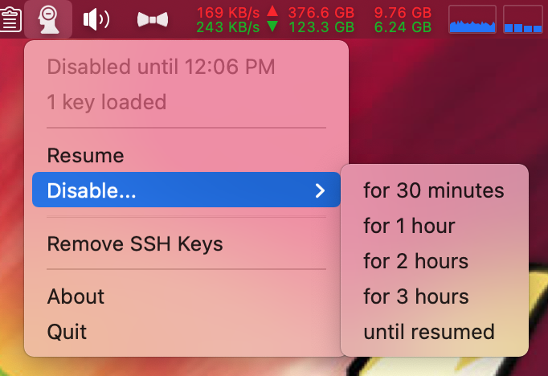

supreSSHion
===========

An OS X menubar agent that listens for screen lock and sleep and then
communicates with ssh-agent to unload keys from memory. It can also
temporarily disable this functionality as requested by the user.

## History

Best practice is to unload your ssh keys from ssh-agent when you're
not actively using them or not at your computer. The problem is no one
remembers to do this themselves.

Long ago I used a tool called SSHKeyChain that filled in for ssh-agent
before OS X had it well integrated. Besides asking you for your key
when it was needed, it would remove the keys on certain events such as
the screen locking. 

SSHKeyChain fell out of support and then a friend of mine wrote a [blog
post](https://www.dribin.org/dave/blog/archives/2007/11/28/securing_ssh_agent/)
and a user deamon called
[ssh_locker](https://github.com/ddribin/ssh_locker) to fill in that
gap. I used ssh_locker for a long time and made
[modifictions](https://github.com/ktgeek/ssh_locker) as times
changed.

One issue is that bring newer developers who are new to ssh, and
aren't familiar with compiling on OS X users up to speed and putting
LaunchAgents in their Library, etc, etc, was problematic.
Additionally, there have been some situations where I've wanted to
temporarily disable the key unloading, which was not easy to do with
the breakground daemon version of ssh_locker. For these reasons a menu
bar application seemed like a good fit.

After giving a talk an internal talk on ssh at my office earlier in
the year, I was inspired to finally turns this into reality.

## How it works

When launched, supreSSHion registers itself as a listener listing for
"screen is locked" and "workplace will sleep" events. When it receives
a lock event, it communicates to ssh-agent over its unix socket using
ssh-agent's protocol asking ssh-agent to unload all known keys.

It locates the unix socket by the SSH_AUTH_SOCK environmental
variable. OS X automatically creates that environmental variable when
you log in.

If the key removal functionality is disabled lock events will not
trigger key removal. When the screen is locked and the experiation
time of the disable has been reached the keys will be removed.
 
When a sleep event is recevied, it will reactivate the key removal if
the user had disabled the key unloading functionality.

### What about loading my SSH key?

You can add `AddKeysToAgent yes` to your ssh config. If your key isn't
loaded when ssh is invoked, ssh will prompt you for your key. (You may
also want to specify your key using `IdentityFile /path/to/id`.)

This doesn't work in all cases where you might use ssh, but 99.99% of
the time I'm invoking ssh from a terminal and it works very well for
me.

## License

supreSSHion is distributed under the MIT free software license, and
freely available for inclusion in other projects.

## Credits

App icon is [Forget by Gregor Cresnar from the Noun
Project](https://thenounproject.com/term/forget/539392/). It is
licensed under [Creative Commons
CCBY](https://creativecommons.org/licenses/by/3.0/us/).
